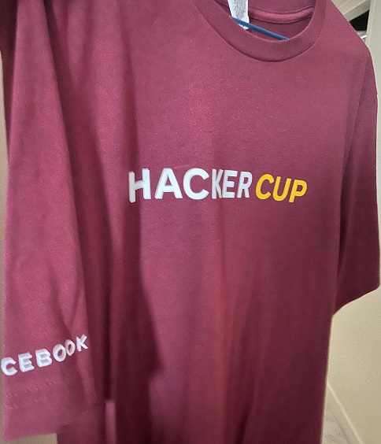

# 🧠 Problem-Solving Practice
 Sep 2017 - Dec2021

This repository contains a selection of problems I've solved over the years during my competitive programming journey. It's not a full archive, but I occasionally added some of the solutions I practiced, especially from contests and well-known platforms like ICPC, UVa, Codeforces, and Hacker Cup.

## 📌 Background

During my bachelor's studies, I was actively involved in competitive programming for around four years. I participated in contests, practiced regularly, and improved my problem-solving and algorithmic thinking by solving hundreds of problems.

## 🏆 Highlights

- Participated in **ACM/ICPC** contests  
  🔗 [View my ICPC contest history](https://icpc.global/ICPCID/WFTQ331WWSF4)

- Reached the **Top 2000 finalists** in the **Meta Hacker Cup 2020**, and received an official t-shirt
- 

- Regular practice on Codeforces  
  🔗 [My Codeforces profile](https://codeforces.com/profile/moniba)

The goal of this repo is to keep a small, curated reference of my problem-solving path.
